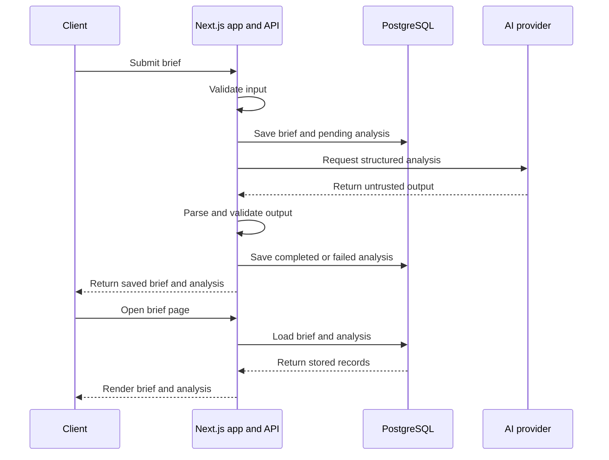
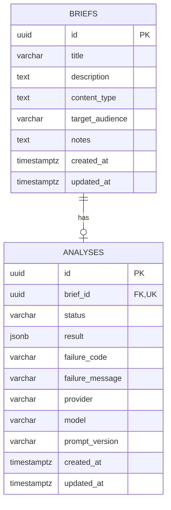
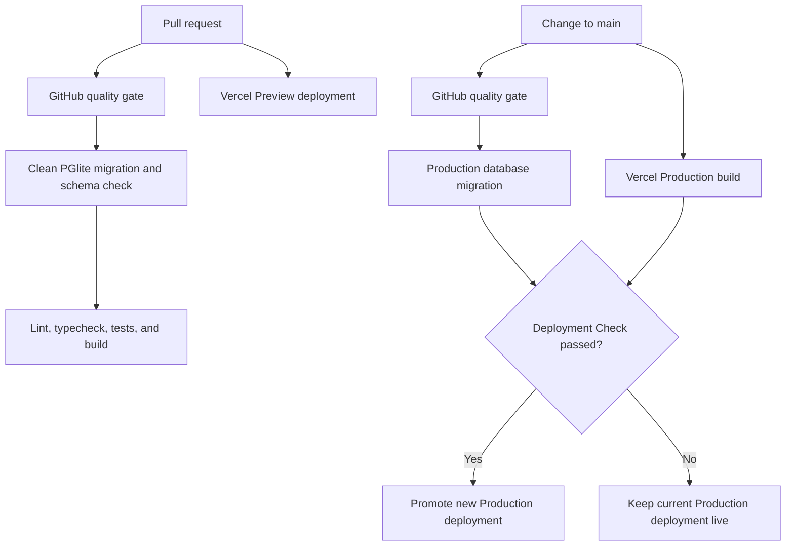

# Studio OS Architecture

Studio OS is one Next.js application with a PostgreSQL database and a configurable AI provider. The browser uses pages for reads and API endpoints for mutations. Server code owns validation, workflow rules, provider calls, and persistence.

## Brief flow



The ordering is deliberate: the brief and a pending analysis are stored before the AI call begins. A timeout, refusal, provider error, or invalid response therefore leaves a saved brief with a retryable failed state.

Retry updates the existing analysis row. The database atomically allows only failed analyses or pending analyses older than the provider timeout plus a five-second grace period to be claimed. The final write also checks the active attempt, so late output cannot overwrite a newer retry.

## Application boundaries

| Area | Responsibility | Main paths |
| --- | --- | --- |
| Pages and client interactions | Render briefs, submit forms, and request retries | `src/app/briefs/`, `src/components/` |
| API | Accept browser mutations and map safe HTTP responses | `src/app/api/`, `src/server/http/` |
| Contracts and workflow | Validate data, preserve ordering, and enforce retry rules | `src/contracts.ts`, `src/server/briefs/` |
| AI analysis | Build the prompt, call the selected provider, and validate its output | `src/server/analysis/` |
| Database | Persist briefs and analyses through one Drizzle repository | `src/server/db/`, `drizzle/` |

Brief list and detail pages are Server Components. They call read services directly instead of calling the application's own API. Client Components are limited to the form and retry interactions.

Database and AI modules are server-only. Credentials must never use a `NEXT_PUBLIC_` prefix or cross into browser code.

## Data schema



`briefs` stores the submitted source material. `analyses` stores one current analysis per brief, enforced by the unique `brief_id` constraint. Its status is `pending`, `completed`, or `failed`; a completed row has a validated JSON result, while a failed row has a safe failure code and message.

The schema source is `src/server/db/schema.ts`. Committed SQL migrations live under `drizzle/`. PGlite and Neon use the same Drizzle schema and migration history.

`content_type` is intentionally stored as PostgreSQL text. Allowed product values are enforced in `src/contracts.ts`, so adding a content type does not require a database migration.

## Environment composition

| Application environment | Database adapter | Required settings |
| --- | --- | --- |
| `local` or `test` | PGlite | `APP_ENV`, `DATABASE_DRIVER=pglite`; local may set `PGLITE_DATA_DIR` |
| `preview` or `production` | Neon HTTP | `APP_ENV`, `DATABASE_DRIVER=neon`, `DATABASE_URL` |

The application rejects PGlite in hosted environments and rejects Neon without a database URL. `pnpm db:migrate` validates these settings and dispatches to the selected adapter. It always applies the committed files under `drizzle/`; shared databases do not use schema push.

The analysis provider is selected separately with `AI_PROVIDER=mock|openai`. Provider adapters return `unknown`. `src/server/analysis/service.ts` owns the timeout, JSON parsing, Zod validation, and safe failure mapping for every provider. OpenAI mode never falls back to mock output.

## API endpoints

| Method and path | Request | Success | Common safe failures |
| --- | --- | --- | --- |
| `POST /api/briefs` | JSON brief input, at most 16 KiB | `201` with the persisted brief and analysis | `400`, `413`, `415`, `422`, `500` |
| `POST /api/briefs/{id}/analysis` | No request body | `200` with the updated persisted brief and analysis | `400`, `413`, `404`, `409`, `422`, `500` |
| `GET /api/health` | None | `200` with `{"status":"healthy","database":"ready"}` | `503` with a generic degraded response |

Mutation responses are not cached and include `X-Request-Id`. Errors use one safe envelope:

```json
{
  "error": {
    "code": "VALIDATION_ERROR",
    "message": "Check the brief fields and try again.",
    "fieldErrors": {},
    "requestId": "request-id"
  }
}
```

The health endpoint performs a bounded read against the migrated database and does not initialize or call the AI provider.

## Release flow



Vercel Git integration owns Preview and Production deployments. GitHub Actions owns the quality gate and database migrations; it contains no application deployment command.

Pull requests use a frozen install, apply committed migrations to a clean PGlite database, verify that the Drizzle schema has matching committed migration history, then run lint, typecheck, the full test suite, and a production build. This validates migration files without production credentials.

Every update to `main` repeats that complete quality gate. The stable `Production database migration` job then enters the branch-restricted GitHub `production` environment and runs the idempotent migration command against Neon. Idempotent means an already-applied migration is safely skipped.

Vercel requires `Production database migration` as a [Deployment Check](https://vercel.com/docs/deployment-checks). Vercel can build at the same time as GitHub Actions, but it promotes the build only when that check passes. A failed migration therefore leaves the previous Production deployment live. There is no automatic database rollback; recovery uses a compatible forward migration.

GitHub stores only the protected production `DATABASE_URL` used by the migration job. Vercel separately stores runtime `DATABASE_URL`, `OPENAI_API_KEY`, `APP_ENV`, `DATABASE_DRIVER`, and provider settings for Preview and Production.

Preview CI validates migrations against clean PGlite. The release does not automate Preview Neon migrations, create a database service per pull request, or create per-pull-request database branches. An operator applies committed migrations to the shared Preview database before testing a preview that needs new schema.

## Add a field to a brief

Use this order so the contract, database, AI input, and UI stay aligned:

1. Define the field's type, optionality, trimming, limits, and compatibility in `briefInputSchema` in `src/contracts.ts`.
2. If the field is stored, add it to `briefs` in `src/server/db/schema.ts`, generate a Drizzle migration, and commit the matching files under `drizzle/`.
3. Map the new column in `src/server/db/repository.ts` for create and read operations.
4. Add the input to `src/components/brief-form.tsx` and render it from the relevant page or component under `src/app/briefs/` or `src/components/`.
5. If the AI should consider the field, add it to the serialized brief data in `src/server/analysis/prompt.ts`. Change `PROMPT_VERSION` when the prompt meaning changes.
6. Update contract, repository, endpoint, form, rendering, prompt, and migration tests as applicable. Run `pnpm db:migrate`, `pnpm lint`, `pnpm typecheck`, `pnpm test`, and `pnpm build`.

For a new content type, update `contentTypeSchema`, the form options, display labels, and tests. Do not add a migration because `content_type` is stored as text.

For a new analysis result field, update `briefAnalysisSchema`, the prompt version, mock output, rendering, parsing tests, and older stored-result compatibility together.
