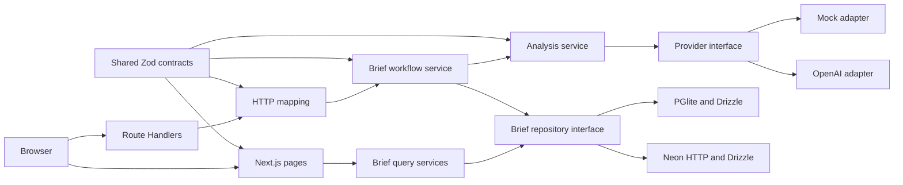
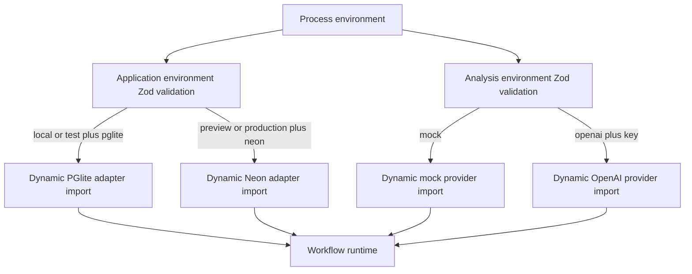
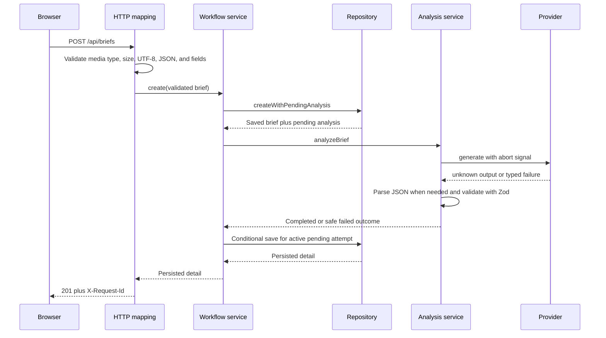
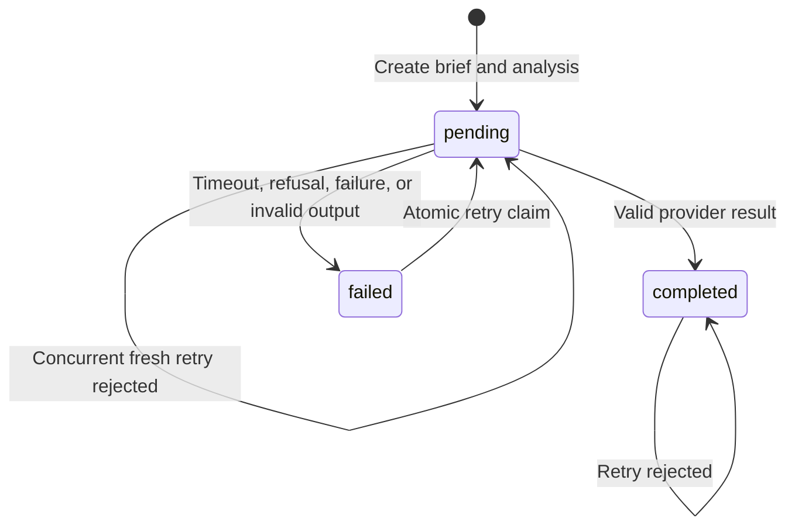
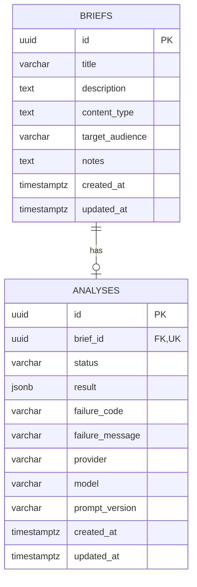

# Studio OS Architecture

## System purpose

Studio OS turns a saved creative brief into a structured creative-readiness review. The system is deliberately synchronous and small: one Next.js application owns the pages, mutation endpoints, service logic, provider adapters, and PostgreSQL persistence.

The architecture protects five invariants:

1. Validate browser and provider data at explicit Zod boundaries.
2. Save the brief and pending analysis before provider work begins.
3. Keep database and provider modules on the server.
4. Use one Drizzle PostgreSQL schema and migration history for PGlite and Neon.
5. Make repeated and concurrent retry requests safe.

## Component map



| Boundary | Responsibility | Current path |
| --- | --- | --- |
| Pages | Server-rendered reads and page composition | `src/app/briefs/` |
| Client components | Form submission and retry interaction only | `src/components/brief-form.tsx`, `src/components/analysis-retry.tsx` |
| Route Handlers | Forward web requests to HTTP mapping | `src/app/api/` |
| HTTP mapping | Media type, size, encoding, ID, body, error, and request-ID handling | `src/server/http/` |
| Services | Persistence ordering, provider execution, retry rules | `src/server/briefs/`, `src/server/analysis/service.ts` |
| Providers | Convert a provider call into `unknown` output or a typed provider failure | `src/server/analysis/` |
| Repository | PostgreSQL reads, writes, conditional updates, and retry claims | `src/server/db/repository.ts` |
| Adapters | Compose PGlite or Neon from validated application settings | `src/server/db/` |
| Contracts | Serializable request, persistence, analysis, and error shapes | `src/contracts.ts` |

Every production module under `src/server/` imports `server-only`. Browser code receives serialized data and safe messages, never database handles, provider clients, or credentials.

## Runtime composition



Database validation in `src/server/config.ts` requires both `APP_ENV` and `DATABASE_DRIVER`. PGlite is allowed only in local and test environments. Neon always requires `DATABASE_URL`. Empty optional environment strings are normalized to absent values before driver-specific validation. The database code ignores hosting-provider environment metadata, so preview and production mapping remains an operations responsibility.

Analysis validation in `src/server/analysis/environment.ts` requires `AI_PROVIDER`. OpenAI requires `OPENAI_API_KEY`; mock requires no secret. `AI_TIMEOUT_MS` defaults to 12000 milliseconds and is capped at 60000. Invalid configuration fails before an adapter is imported or a side effect begins.

PGlite is imported dynamically only after local or test validation. `next.config.ts` keeps its native package outside the Next.js server bundle. Neon selection does not import or create PGlite.

## Read paths and UI flows

The root page redirects to `/briefs`. The board and detail page are dynamic Server Components. They call query services directly and close the local database handle in `finally` blocks. They do not make loopback HTTP calls to the application's own endpoints.

| Route | Read path | User-visible states |
| --- | --- | --- |
| `/briefs` | `BriefsPage` to `listBriefsFromEnvironment` to repository `list` | Empty board or briefs sorted newest first |
| `/briefs/new` | Static page with client `BriefForm` | Entry, field errors, submitting, uncertain submission |
| `/briefs/{id}` | `BriefDetailPage` to `findBriefDetailFromEnvironment` | Not found, completed, failed, pending, or unreadable analysis |

Only the form and retry control are Client Components. Server state stays in the database and is refreshed through Next.js navigation rather than copied into a client store.

## Create flow and persistence ordering



`createWithPendingAnalysis` creates one brief and one analysis record before provider execution. PGlite uses a Drizzle transaction. Neon sends both inserts in one Drizzle HTTP batch. If provider work times out, refuses, fails, or returns malformed output, the brief remains saved and the analysis becomes a safe failed record.

The final analysis update matches the analysis ID, `pending` status, and the attempt's `updatedAt` value. A late response from an obsolete attempt cannot overwrite a newer claim.

## Provider boundary and parsing

The `AnalysisProvider` interface returns `Promise<unknown>`. This is intentional. TypeScript types cannot make an external response trustworthy.

- The mock adapter returns an object or an explicit timeout or malformed scenario.
- The OpenAI adapter requests Structured Outputs through the Responses API, disables provider-side storage with `store: false`, and disables SDK retries with `maxRetries: 0`.
- The adapter detects refusals and incomplete or empty responses, but does not claim the content is valid.
- `analyzeBrief` owns the timeout, parses JSON strings locally, validates the complete result with `briefAnalysisSchema`, and maps expected failures to safe stored codes.
- OpenAI selection never falls back to mock output.

Stored failure codes are `MODEL_TIMEOUT`, `MODEL_REFUSAL`, `MODEL_PROVIDER_ERROR`, and `MODEL_INVALID_RESPONSE`. The browser receives safe recovery text, not raw provider output or exceptions.

## Retry and concurrency behavior



Retry updates the existing analysis row. It never creates another brief or analysis row.

The repository atomically claims only:

- A failed analysis.
- A pending analysis older than `AI_TIMEOUT_MS + 5 seconds`.

A completed analysis returns `ANALYSIS_NOT_RETRYABLE`. A fresh pending analysis returns `ANALYSIS_IN_PROGRESS`. Concurrent claim attempts use one conditional database update, so only one request owns provider execution. The final conditional save prevents a previous owner from writing after stale recovery.

## PostgreSQL schema and migrations



`briefs` stores the submitted source material. `analyses` stores exactly one current analysis per brief through the unique `brief_id` constraint. Deleting a brief at the database level cascades to its analysis, although deletion is not an application capability.

The schema source is `src/server/db/schema.ts`. The committed SQL history is under `drizzle/`. PGlite and Neon use that same PostgreSQL schema and migration history.

`content_type` is intentionally PostgreSQL `text`. Current product values are enforced by `contentTypeSchema`, so adding a supported value does not require a database migration. Analysis status, provider name, and analysis result shape are also validated in application contracts before use, while the database keeps the storage representation simple.

The current schema has primary-key, foreign-key, and one-analysis-per-brief uniqueness constraints. It has no additional query indexes. That is acceptable for the current small internal board, but list or search growth must introduce evidence-based indexes through a committed migration.

## HTTP contracts

All request and response bodies use JSON unless stated otherwise. Dates in JSON responses are ISO 8601 strings because `Response.json` serializes stored `Date` values.

### Create a brief

`POST /api/briefs`

Required header: `Content-Type: application/json`. Parameters such as `charset=utf-8` are accepted. The maximum body size is 16 KiB.

```json
{
  "title": "A quiet city wakes",
  "description": "An animated short about a baker discovering that the city is alive before dawn.",
  "contentType": "short_film",
  "targetAudience": "Families who enjoy gentle imaginative animation.",
  "notes": null
}
```

Field rules:

| Field | Rule |
| --- | --- |
| `title` | Trimmed string, 3 to 120 characters |
| `description` | Trimmed string, 20 to 2000 characters |
| `contentType` | `short_film`, `series`, `feature`, `commercial`, `music_video`, or `other` |
| `targetAudience` | Trimmed string, 3 to 500 characters |
| `notes` | Optional or null, trimmed, up to 2000 characters; empty becomes null |

Success is `201` with the persisted brief and its analysis. Provider failure is still a successful create when persistence succeeds: the response remains `201`, with `analysis.status` set to `failed` and safe failure fields stored for retry.

### Retry analysis

`POST /api/briefs/{id}/analysis`

`id` must be a UUID. The request body must be empty. Success is `200` with the same persisted brief and updated analysis record.

### Shared mutation response behavior

Mutation responses include:

- `Cache-Control: no-store`.
- `X-Request-Id`, matching `error.requestId` on failures.
- A persisted brief detail on success.
- The shared safe error envelope on failure.

```json
{
  "error": {
    "code": "VALIDATION_ERROR",
    "message": "Check the brief fields and try again.",
    "fieldErrors": {
      "title": ["Too small: expected string to have >=3 characters"]
    },
    "requestId": "00000000-0000-4000-8000-000000000000"
  }
}
```

| Status | Code | Meaning |
| --- | --- | --- |
| `400` | `INVALID_CONTENT_LENGTH` | `Content-Length` is not a non-negative integer |
| `400` | `INVALID_BODY_ENCODING` | Body is not valid UTF-8 |
| `400` | `INVALID_JSON` | Create body is empty or malformed JSON |
| `400` | `UNEXPECTED_REQUEST_BODY` | Retry body is not empty |
| `404` | `BRIEF_NOT_FOUND` | Retry target does not exist |
| `409` | `ANALYSIS_IN_PROGRESS` | Pending work is not stale |
| `409` | `ANALYSIS_NOT_RETRYABLE` | Analysis is completed or missing |
| `409` | `ANALYSIS_CLAIM_LOST` | Another request changed the active attempt |
| `413` | `REQUEST_TOO_LARGE` | Declared or streamed body exceeds 16 KiB |
| `415` | `UNSUPPORTED_MEDIA_TYPE` | Create request is not JSON |
| `422` | `VALIDATION_ERROR` | Brief fields do not satisfy the contract |
| `422` | `INVALID_BRIEF_ID` | Retry path ID is not a UUID |
| `500` | `INTERNAL_ERROR` | Unexpected server failure mapped without internals |

Logs contain event name, request ID, HTTP status, safe code, and analysis status where applicable. Submitted brief text, credentials, raw provider responses, database URLs, queries, and stack traces are not intentionally logged by these handlers.

### Database health

`GET /api/health`

The route is forced dynamic and every response uses `Cache-Control: no-store`.

Healthy response:

```http
HTTP/1.1 200 OK
Cache-Control: no-store

{"status":"healthy","database":"ready"}
```

Degraded response:

```http
HTTP/1.1 503 Service Unavailable
Cache-Control: no-store

{"status":"degraded","database":"unavailable"}
```

The two-second budget covers environment validation, adapter creation, a real query against the migrated `briefs` table, and adapter close. The endpoint never creates or invokes an analysis provider and never returns internal error details.

## Field and contract change guides

### Add a content type

No database migration is required because `briefs.content_type` is PostgreSQL text.

1. Add the value to `contentTypeSchema` in `src/contracts.ts`.
2. Add its form option in `src/components/brief-form.tsx`.
3. Add its display label in `src/components/brief-list.tsx` and `src/app/briefs/[id]/page.tsx`.
4. Update contract, form, list, detail, prompt, and repository tests that enumerate or render content types.
5. Update the field table in this document and the README if the user-facing behavior changes.
6. Break the new coverage guard, confirm it fails, restore it, and run the complete quality gate.

### Add or change a brief input field

1. Decide optionality, trimming, length, and compatibility in `briefInputSchema` first.
2. Update `briefs` in `src/server/db/schema.ts` when persistence changes.
3. Generate and commit a Drizzle migration. Never use schema push for a shared database.
4. Update repository row mapping, the form, detail rendering, prompt serialization, fixtures, endpoint tests, and documentation.
5. Keep old clients compatible by making new request fields optional or giving them a documented default when required.
6. Prove the migration on clean PGlite and verify the contract diff before any Neon migration.

### Change analysis output

1. Change `briefAnalysisSchema` in `src/contracts.ts`.
2. Update the prompt and increment `PROMPT_VERSION` in `src/server/analysis/prompt.ts`.
3. Update the mock provider so it still satisfies the real contract.
4. Update rendered analysis, provider parsing tests, malformed-output tests, and stored-result fixtures.
5. Decide how older stored JSON remains readable before making a required field incompatible.

### Add an analysis provider

1. Extend `AnalysisProviderName` and environment validation.
2. Implement a server-only adapter that returns `unknown` and maps provider failures without logging raw content or credentials.
3. Keep timeout and schema parsing in `analyzeBrief`.
4. Add provider-focused tests and configuration failure tests.
5. Add the documented environment settings without adding a silent fallback.

### Change an endpoint

1. Update the shared Zod contract before the handler.
2. Keep Route Handlers thin and put request mapping in `src/server/http/` and business rules in a service.
3. Preserve the shared error envelope, request ID, no-store behavior, body limit, and compatibility expectations.
4. Update handler tests, rendered client behavior, README summaries, and this contract section together.

## Deliberate tradeoffs

| Decision | Benefit | Cost and boundary |
| --- | --- | --- |
| One Next.js application | One deployable unit and direct Server Component reads | API and UI release together |
| Synchronous provider call | Simple request ownership and immediate detail response | Request duration is bounded by the provider timeout and is not suited to long-running work |
| PGlite locally and Neon when hosted | Local setup needs no external database while retaining PostgreSQL behavior | Two adapters and environment composition must stay tested |
| Drizzle repository interface | Services can be tested against narrow behavior | Storage-specific batch and transaction details remain in adapters |
| Application validation for selected string values | Content types can change without routine migrations | Database clients outside the app could write values the app cannot read safely |
| One mutable analysis row per brief | Simple current-state reads and atomic retry ownership | No analysis history or comparison view |
| Safe generic errors | Protects credentials, submitted content, and provider details | Operators currently have only console events and request IDs |
| No authentication yet | Keeps this delivery focused on the brief workflow | The application is not ready for untrusted public access |

## Explicit exclusions

The current architecture does not include authentication, authorization, editing, deletion, collaboration, uploads, queues, background workers, model routing, provider fallback, analytics, external monitoring, deployment automation, or a separate public API.

Do not add one of these capabilities as an incidental extension. Each changes data access, ownership, failure behavior, or operations enough to require an approved scope decision.

## Roadmap boundary

- Task 9 owns migration consistency checks, serialized CI-owned production migration and deployment, Vercel configuration, preview readiness, and the release security gate.
- Task 10 owns live production verification, stable URL evidence, production workflow checks, rollback boundary, and final operational handoff.
- This task does not claim production readiness or a live deployment.

## Verified baseline

Task 8 uses the following clean-checkout gate:

```bash
corepack enable
pnpm install --frozen-lockfile
cp .env.example .env.local
pnpm db:migrate
pnpm lint
pnpm typecheck
pnpm test
pnpm build
pnpm dev
curl --fail --show-error http://localhost:3000/api/health
```

The documentation verification also checks every relative Markdown link and repository path, parses and renders every Mermaid diagram, confirms the diff contains only human-readable Markdown, runs `git diff --check`, and inspects the complete diff against fresh `origin/main`.

Recorded on 2026-08-22 from an isolated clean copy of the Task 8 branch:

| Check | Result |
| --- | --- |
| Frozen install | Passed with pnpm 10.33.0 from no `node_modules` using the committed lockfile |
| Local committed migration | Passed through `pnpm db:migrate` with `.env.local` copied directly from `.env.example` |
| Lint | Passed with ESLint |
| Strict typecheck | Passed with no emitted files |
| Full Vitest suite | 28 test files passed, 104 tests passed |
| Production build | Passed with Next.js 16.3.2; static and dynamic routes were classified as documented |
| Local brief create, detail, failed analysis, retry, and health paths | Passed against isolated PGlite in development mode; production start and health also passed |
| Markdown links, paths, and Mermaid diagrams | All relative links, anchors, and documented paths passed; all five diagrams parsed and rendered |

The new migration CLI integration guard was seen to fail before the fix by setting the same empty optional `DATABASE_URL` produced when `.env.example` is copied for local use. It then passed after empty optional environment strings were normalized to absent values. Existing composition tests continue to prove that explicit local PGlite and production Neon settings dispatch only to their selected migration adapters.

The OpenAI adapter is covered by deterministic tests with a fake client. Task 8 does not make a paid external provider call, migrate Neon, deploy, or claim production verification. Those boundaries keep credentials out of documentation and preserve Tasks 9 and 10.

## AI assistance disclosure

This repository was developed with AI-assisted planning, implementation, review, and documentation. The maintainer owns the architecture and delivery decisions, verified this document against the repository, and remains responsible for the code, documentation, and release choices.
